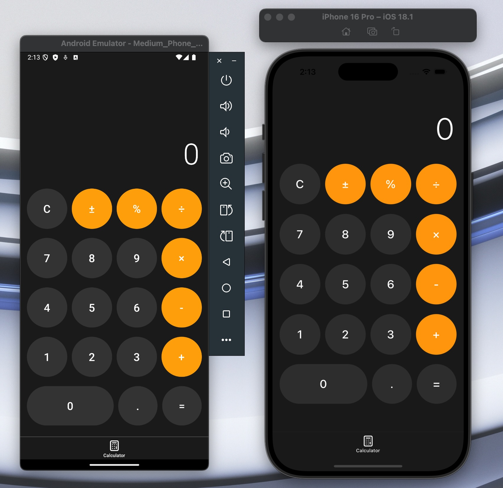

# Expo Calculator

A beautiful, responsive calculator app built with Expo and Bolt. This project demonstrates how to create a professional-grade calculator that works seamlessly across mobile and web platforms.



## 🚀 Features

- Clean, iOS-inspired design with dark mode
- Fully responsive layout for both mobile and web platforms
- Basic arithmetic operations (addition, subtraction, multiplication, division)
- Decimal point support
- Clear function (C) to reset calculations
- Safe area handling for modern devices

## 🛠 Technologies

- [Expo](https://expo.dev/) - The framework for universal React applications
- [Expo Router](https://docs.expo.dev/router/introduction/) - File-based routing for Expo apps
- [React Native](https://reactnative.dev/) - Build native apps using React
- [TypeScript](https://www.typescriptlang.org/) - Type-safe JavaScript
- [Lucide Icons](https://lucide.dev/) - Beautiful open-source icons

## 📱 Platform Support

- iOS
- Android

## 🏗 Built with Bolt

This project was created using [Bolt](https://github.com/stackblitz/bolt), a powerful AI assistant that helps developers create production-ready applications. Bolt provided the initial project structure and helped implement best practices throughout the development process.

## 🚀 Getting Started

1. Clone the repository:

   ```bash
   git clone https://github.com/haris-0525/expo-calculator.git
   ```

2. Install dependencies:

   ```bash
   npm install
   ```

3. Start the development server:

   ```bash
   npm run dev
   ```

4. Open the app:
   - 📱 iOS: Press 'i' in the terminal
   - 🤖 Android: Press 'a' in the terminal

## 🎯 Key Features Explained

### Responsive Design

The calculator adapts its layout and styling based on the platform and screen size, ensuring a consistent experience across devices.

### Cross-Platform Compatibility

Built using Expo's managed workflow, the app runs natively on iOS and Android.

### Type Safety

Written in TypeScript, providing better developer experience and catching potential errors during development.

## 🤝 Contributing

Contributions, issues, and feature requests are welcome! Feel free to check [issues page](https://github.com/haris-0525/expo-calculator/issues).

## 👏 Acknowledgments

- Built with [Bolt](https://github.com/stackblitz/bolt)
- Design inspired by iOS Calculator
- Icons provided by [Lucide](https://lucide.dev/)
